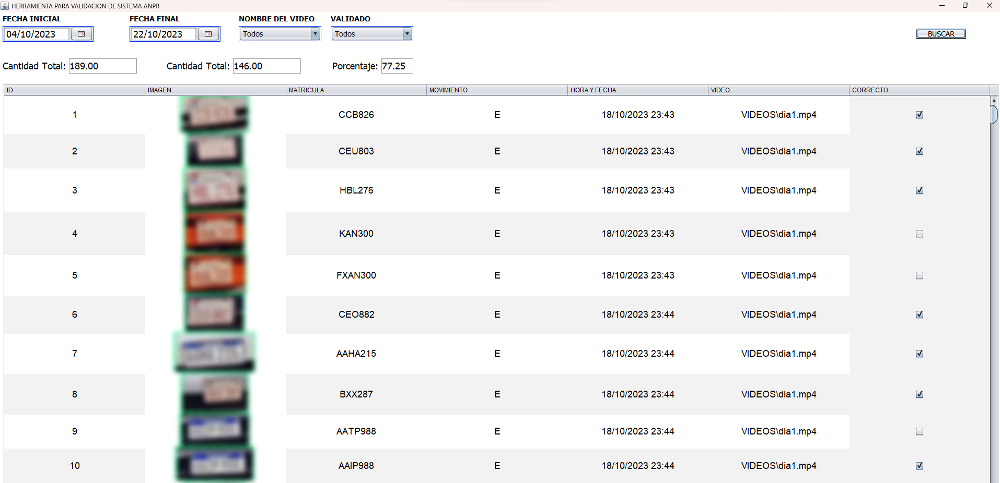

# Validación Manual de Sistema ANPR

## Descripción del Proyecto (Project Description)

Este proyecto es una herramienta diseñada para simplificar y acelerar el proceso de validación manual de un sistema ANPR (Automatic Number Plate Recognition). Permite filtrar y visualizar recortes de imágenes almacenadas en una base de datos PostgreSQL, facilitando la validación de las placas vehiculares capturadas por el sistema. Además, ofrece la capacidad de cambiar el estado de "correcto" a "incorrecto" con solo presionar la barra espaciadora, y calcula el porcentaje de aciertos a medida que se realizan validaciones.

This project is a tool created to streamline and expedite the manual validation process of an ANPR (Automatic Number Plate Recognition) system. It enables filtering and displaying image cutouts stored in a PostgreSQL database, making it easier to validate vehicle plates captured by the system. Furthermore, it provides the ability to toggle between "correct" and "incorrect" states with a simple press of the spacebar, and calculates the accuracy percentage as validations are performed.

## Capturas de Pantalla (Screenshots)

## Funcionalidades Destacadas (Key Features)

- Filtrado y visualización de recortes de imágenes a partir de una base de datos PostgreSQL.
- Cambio de estado de "correcto" a "incorrecto" con la tecla espaciadora.
- Cálculo automático del porcentaje de aciertos durante la validación.
- Interfaz de usuario intuitiva y amigable.

## Instrucciones de Uso (Usage Instructions)

1. Clone el repositorio en su máquina local.
2. Configure la conexión a la base de datos PostgreSQL en la aplicación.
3. Ejecute la aplicación y seleccione un rango de fechas para filtrar las imágenes.
4. Utilice la tecla espaciadora para cambiar el estado de "correcto" a "incorrecto".
5. Supervise el porcentaje de aciertos en la pantalla.

## Licencia (License)

Este proyecto está bajo la Licencia [MIT](LICENSE).

This project is licensed under the [MIT License](LICENSE).
